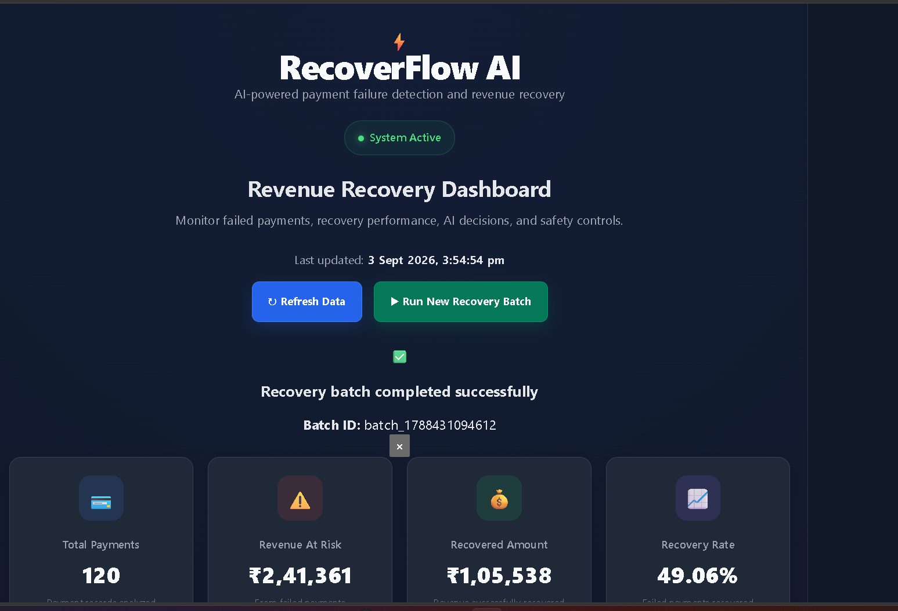
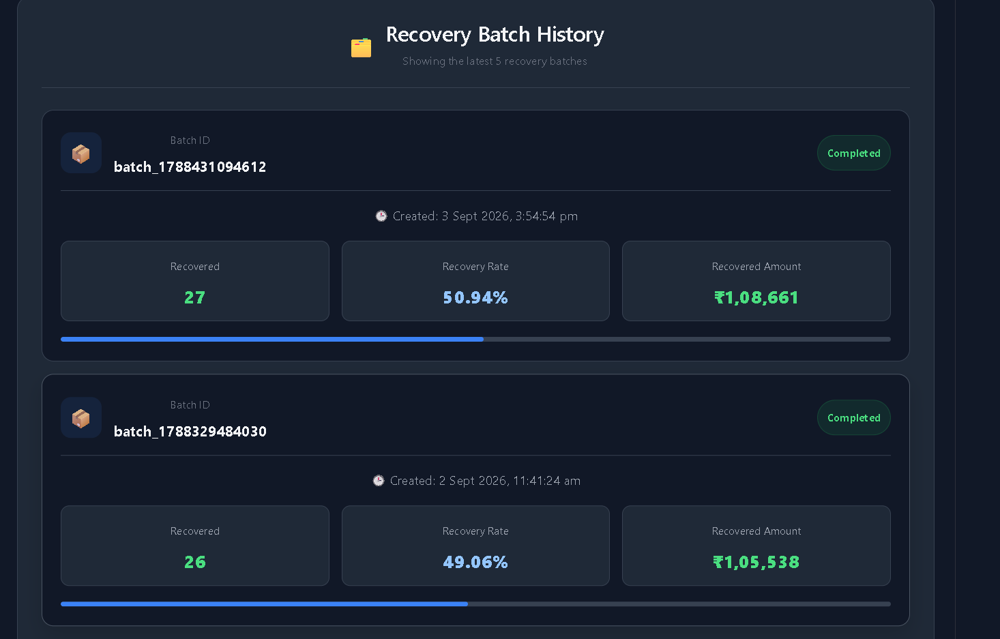
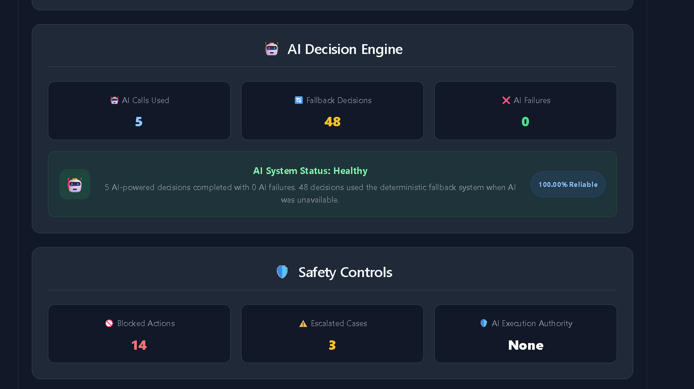

# RecoverFlow AI 💳🤖

### AI-Powered Payment Failure Recovery & Revenue Protection System

RecoverFlow AI is an intelligent payment recovery system designed to analyze failed payments, identify possible failure causes, apply safety policies, and recommend or execute controlled recovery actions.

The system combines **AI-powered diagnosis**, **deterministic fallback logic**, **policy-based safety controls**, **controlled recovery execution**, **batch processing**, **persistent audit trails**, and a **real-time dashboard**.

---

## 🚀 Problem Statement

Failed online payments can result in significant revenue loss.

Common reasons include:

- Network timeouts
- Technical failures
- Bank declines
- Insufficient funds
- Authentication issues
- Customer abandonment

Simply retrying every failed payment is not always safe or effective.

RecoverFlow AI addresses this problem by intelligently analyzing failed payments and determining the appropriate recovery strategy.

---

## 💡 Solution

RecoverFlow AI follows a controlled recovery pipeline:

```text
Failed Payment
      ↓
AI Diagnosis
      ↓
Fallback Diagnosis (if AI is unavailable)
      ↓
Safety Policy Evaluation
      ↓
Recovery Decision
      ↓
Controlled Execution
      ↓
Audit Trail
      ↓
Analytics Dashboard
```

3. Safety Policy Engine

AI does not directly execute payment actions.

Every recommended action is passed through a policy and safety layer before execution.

Possible policy decisions include:

APPROVE
BLOCK
ESCALATE

This ensures controlled and safe recovery behavior.

4. Recovery Batch Processing

The system can process multiple failed payments as a recovery batch.

For each failed payment, the system:

Analyzes the payment
Generates a diagnosis
Recommends an action
Applies policy validation
Executes the simulated recovery action if approved
Records the outcome
Saves the batch for future analytics 5. Recovery Analytics Dashboard

The frontend dashboard provides a clear view of payment and recovery performance.

It displays:

Total payments
Successful payments
Failed payments
Revenue at risk
Recovered amount
Recovery rate
Money recovery rate
AI calls used
AI failures
Fallback decisions
Blocked actions
Escalated cases
Latest recovery batch
Recovery batch history
Audit trail 6. Persistent Recovery Batch History

Recovery batches are saved locally so that previous recovery results can be viewed later.

The dashboard displays recent recovery batches with information such as:

Batch ID
Creation time
Recovered payments
Recovery rate
Recovered amount 7. Persistent Audit Trail

Important recovery actions are recorded in a persistent audit trail.

Each record can contain information about:

Payment ID
Recommended action
Policy decision
Execution status
Recovery outcome
Timestamp

This improves transparency and traceability.

🏗️ System Architecture

     3. Safety Policy Engine

AI does not directly execute payment actions.

Every recommended action is passed through a policy and safety layer before execution.

Possible policy decisions include:

APPROVE
BLOCK
ESCALATE

This ensures controlled and safe recovery behavior.

4. Recovery Batch Processing

The system can process multiple failed payments as a recovery batch.

For each failed payment, the system:

Analyzes the payment
Generates a diagnosis
Recommends an action
Applies policy validation
Executes the simulated recovery action if approved
Records the outcome
Saves the batch for future analytics 5. Recovery Analytics Dashboard

The frontend dashboard provides a clear view of payment and recovery performance.

It displays:

Total payments
Successful payments
Failed payments
Revenue at risk
Recovered amount
Recovery rate
Money recovery rate
AI calls used
AI failures
Fallback decisions
Blocked actions
Escalated cases
Latest recovery batch
Recovery batch history
Audit trail 6. Persistent Recovery Batch History

Recovery batches are saved locally so that previous recovery results can be viewed later.

The dashboard displays recent recovery batches with information such as:

Batch ID
Creation time
Recovered payments
Recovery rate
Recovered amount 7. Persistent Audit Trail

Important recovery actions are recorded in a persistent audit trail.

Each record can contain information about:

Payment ID
Recommended action
Policy decision
Execution status
Recovery outcome
Timestamp

This improves transparency and traceability.

🏗️ System Architecture
┌──────────────────────┐
│ Failed Payments │
└──────────┬───────────┘
│
▼
┌──────────────────────┐
│ AI Payment Diagnosis │
│ Gemini AI │
└──────────┬───────────┘
│
AI unavailable?
│
▼
┌──────────────────────┐
│ Deterministic Fallback│
└──────────┬───────────┘
│
▼
┌──────────────────────┐
│ Recommended Action │
└──────────┬───────────┘
│
▼
┌──────────────────────┐
│ Safety Policy Engine │
└──────────┬───────────┘
│
┌───────────┴───────────┐
│ │
▼ ▼
APPROVE BLOCK / ESCALATE
│
▼
┌───────────────────┐
│ Recovery Execution │
│ (Simulated) │
└─────────┬─────────┘
│
▼
┌───────────────────┐
│ Batch + Audit Log │
└─────────┬─────────┘
│
▼
┌───────────────────┐
│ React Dashboard │
└───────────────────┘

## 📸 Project Screenshots

### RecoverFlow AI Dashboard



### Recovery Batch History



### Audit Trail



       🛠️ Tech Stack

Frontend
React
Vite
JavaScript
CSS
Fetch API
Backend
Node.js
Express.js
JavaScript

AI
Google Gemini API
@google/genai
Data Storage

Currently, the project uses JSON-based local persistence for:

Payment data
Recovery batches
Audit logs

📂 Project Structure
Razorpay-Buildathon/
│
├── backend/
│ │
│ ├── services/
│ │ ├── aiService.js
│ │ ├── paymentService.js
│ │ ├── recoveryService.js
│ │ ├── recoveryBatchService.js
│ │ ├── dashboardService.js
│ │ └── auditService.js
│ │
│ ├── data/
│ │ ├── payments.json
│ │ ├── batches.json
│ │ └── auditLogs.json
│ │
│ ├── server.js
│ ├── package.json
│ └── .env
│
├── frontend/
│ │
│ ├── src/
│ │ ├── App.jsx
│ │ ├── App.css
│ │ └── main.jsx
│ │
│ ├── package.json
│ └── vite.config.js
│
├── README.md
└── .gitignore

Installation and Setup

1. Clone the Repository
   git clone <YOUR_GITHUB_REPOSITORY_URL>

Move into the project directory:

cd RecoverFlow-AI
Backend Setup

Move to the backend folder:

cd backend

Install dependencies:

npm install

Create a .env file:

GEMINI_API_KEY=your_gemini_api_key_here

Start the backend:

npm run dev

The backend runs on:

http://localhost:5000
Frontend Setup

Open a new terminal and move to the frontend folder:

cd frontend

Install dependencies:

npm install

Start the frontend:

npm run dev

Open the local URL displayed by Vite in your browser.

API Workflow
Diagnose a Payment
GET /api/payments/:paymentId/diagnose

The system analyzes a failed payment using Gemini AI.

If AI is unavailable, deterministic fallback logic is used.

Apply Safety Policy

The recommended recovery action is checked against the safety policy layer before execution.

Example response:

{
"decision": "APPROVE",
"action": "retry_payment",
"reason": "Recovery action passed all safety policy checks"
}
Execute Recovery

An approved recovery action can be executed and the outcome is recorded.

Example:

{
"executed": true,
"outcome": "recovered",
"recovered_amount": 1612
}
Run a Recovery Batch
POST /api/recovery/batch

This endpoint processes failed payments and creates a new recovery batch.

The results are saved and the dashboard is refreshed automatically.

Reliability Design

RecoverFlow AI is designed so that the complete recovery workflow does not depend entirely on an external AI API.

Gemini AI Available
│
▼
AI Diagnosis
│
▼
Safety Policy
│
▼
Recovery Execution

If Gemini AI is unavailable:

Gemini AI Failure / Rate Limit
│
▼
Deterministic Fallback
│
▼
Safety Policy
│
▼
Recovery Execution

This makes the system more resilient and reliable.

Current Dashboard Capabilities

The dashboard provides:

Real-time dashboard refresh
Loading state
Error state
Recovery batch running state
Success message after batch completion
Empty batch history state
Latest 5 recovery batches
Progress indicators
Recovery metrics
AI system metrics
Persistent recovery batch history
Future Improvements

Possible future enhancements include:

Database integration using MongoDB or PostgreSQL
User authentication
Role-based access control
Real payment gateway integration
Background job processing
Retry scheduling
Email recovery links
Advanced analytics and charts
Production deployment
Docker containerization
Project Demonstration Flow

A typical RecoverFlow AI workflow is:

1. Payment fails
   ↓
2. AI analyzes failure
   ↓
3. Fallback is used if AI is unavailable
   ↓
4. Recovery action is recommended
   ↓
5. Safety policy validates the action
   ↓
6. Approved action is executed
   ↓
7. Recovery outcome is recorded
   ↓
8. Batch and audit information are stored
   ↓
9. Dashboard displays updated results
   Key Learning Areas

This project demonstrates practical experience with:

AI API integration
AI fallback strategies
Backend API development
React frontend development
Payment failure analysis
Safety policy design
Persistent data storage
Audit logging
Error handling
API reliability
Full-stack application development
